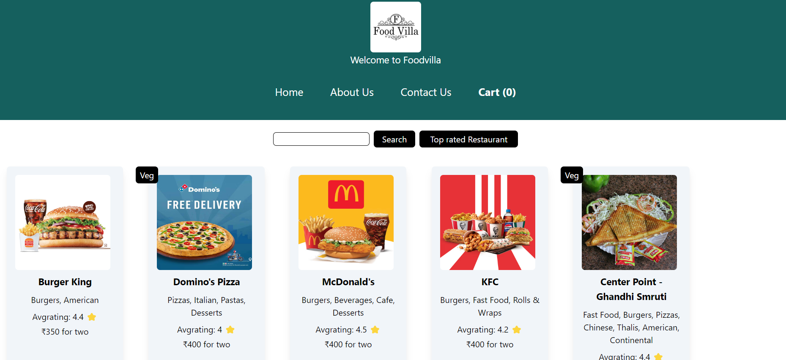
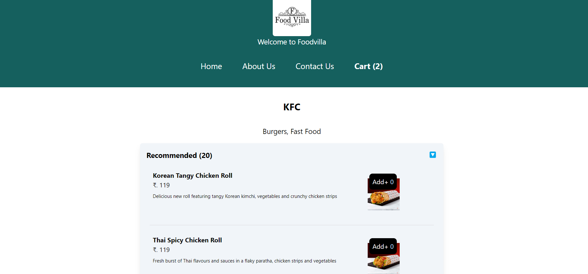
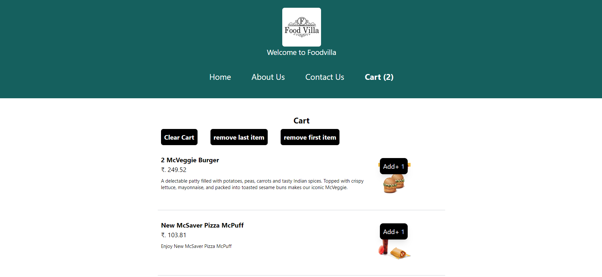
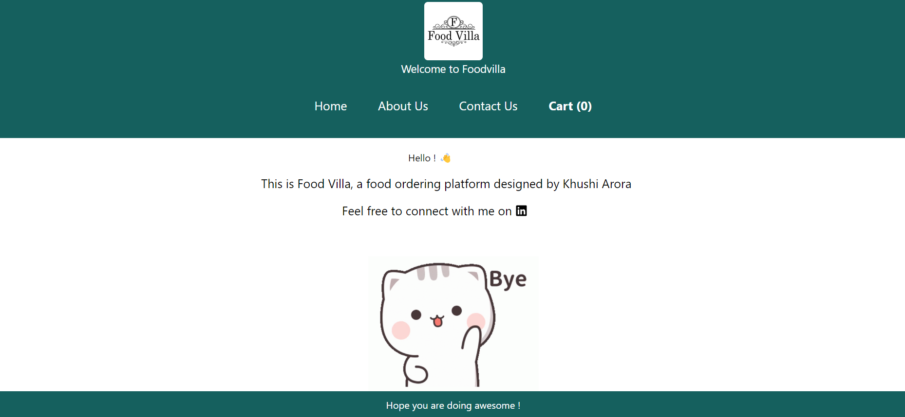
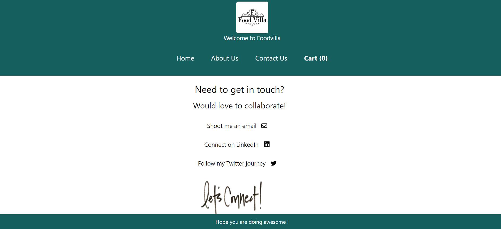

## FoodVilla

FoodVilla is an online food ordering app, which integrates with Swiggy APIs to fetch restaurant details. It futher allows the users to explore the menu offered by these restaurants, and add them to cart for placing the order.

## Tech Stack Used

- React
- Redux Toolkit
- Tailwind CSS
- Jest

## Screenshots

